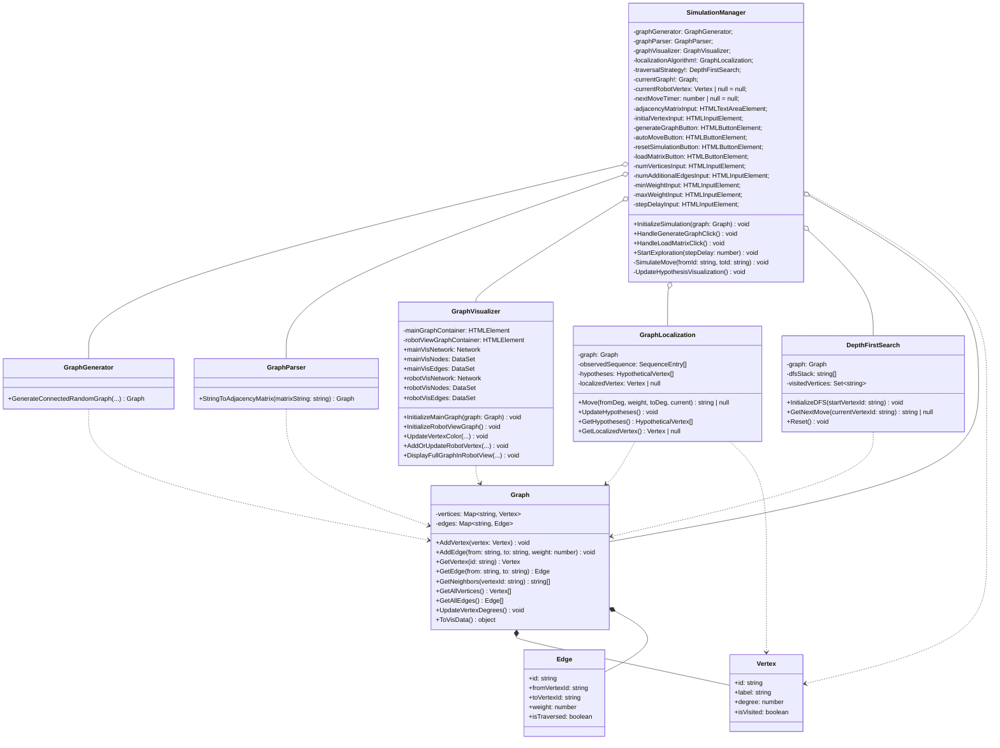

```mermaid
classDiagram
    class Vertex {
        +id: string
        +label: string
        +degree: number
        +isVisited: boolean
    }

    class Edge {
        +id: string
        +fromVertexId: string
        +toVertexId: string
        +weight: number
        +isTraversed: boolean
    }

    class Graph {
        -vertices: Map~string, Vertex~
        -edges: Map~string, Edge~
        +AddVertex(vertex: Vertex) void
        +AddEdge(from: string, to: string, weight: number) void
        +GetVertex(id: string) Vertex
        +GetEdge(from: string, to: string) Edge
        +GetNeighbors(vertexId: string) string[]
        +GetAllVertices() Vertex[]
        +GetAllEdges() Edge[]
        +UpdateVertexDegrees() void
        +ToVisData() object
    }

    class GraphLocalization {
        -graph: Graph
        -observedSequence: SequenceEntry[]
        -hypotheses: HypotheticalVertex[]
        -localizedVertex: Vertex | null
        +Move(fromDeg, weight, toDeg, current) string | null
        +UpdateHypotheses() void
        +GetHypotheses() HypotheticalVertex[]
        +GetLocalizedVertex() Vertex | null
    }

    class DepthFirstSearch {
        -graph: Graph
        -dfsStack: string[]
        -visitedVertices: Set~string~
        +InitializeDFS(startVertexId: string) void
        +GetNextMove(currentVertexId: string) string | null
        +Reset() void
    }

    class GraphGenerator {
        +GenerateConnectedRandomGraph(...) Graph
    }

    class GraphParser {
        +StringToAdjacencyMatrix(matrixString: string) Graph
    }

    class GraphVisualizer {
        -mainGraphContainer: HTMLElement
        -robotViewGraphContainer: HTMLElement
        +mainVisNetwork: Network
        +mainVisNodes: DataSet<any>
        +mainVisEdges: DataSet<any>
        +robotVisNetwork: Network
        +robotVisNodes: DataSet<any>
        +robotVisEdges: DataSet<any>
        +InitializeMainGraph(graph: Graph) void
        +InitializeRobotViewGraph() void
        +UpdateVertexColor(...) void
        +AddOrUpdateRobotVertex(...) void
        +DisplayFullGraphInRobotView(...) void
    }

    class SimulationManager {
        -graphGenerator: GraphGenerator;
        -graphParser: GraphParser;
        -graphVisualizer: GraphVisualizer;
        -localizationAlgorithm!: GraphLocalization;
        -traversalStrategy!: DepthFirstSearch;
        -currentGraph!: Graph;
        -currentRobotVertex: Vertex | null = null;
        -nextMoveTimer: number | null = null;
        -adjacencyMatrixInput: HTMLTextAreaElement;
        -initialVertexInput: HTMLInputElement;
        -generateGraphButton: HTMLButtonElement;
        -autoMoveButton: HTMLButtonElement;
        -resetSimulationButton: HTMLButtonElement;
        -loadMatrixButton: HTMLButtonElement;
        -numVerticesInput: HTMLInputElement;
        -numAdditionalEdgesInput: HTMLInputElement;
        -minWeightInput: HTMLInputElement;
        -maxWeightInput: HTMLInputElement;
        -stepDelayInput: HTMLInputElement;
        +InitializeSimulation(graph: Graph) void
        +HandleGenerateGraphClick() void
        +HandleLoadMatrixClick() void
        +StartExploration(stepDelay: number) void
        -SimulateMove(fromId: string, toId: string) void
        -UpdateHypothesisVisualization() void
    }

    Graph *-- Vertex
    Graph *-- Edge

    SimulationManager o-- GraphGenerator
    SimulationManager o-- GraphParser
    SimulationManager o-- GraphVisualizer
    SimulationManager o-- GraphLocalization
    SimulationManager o-- DepthFirstSearch
    SimulationManager o-- Graph

    GraphGenerator ..> Graph
    GraphParser ..> Graph
    GraphVisualizer ..> Graph
    GraphLocalization ..> Graph
    DepthFirstSearch ..> Graph
    GraphLocalization ..> Vertex
    SimulationManager ..> Vertex
```